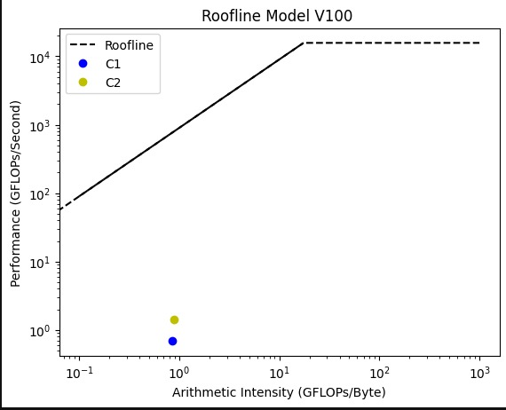
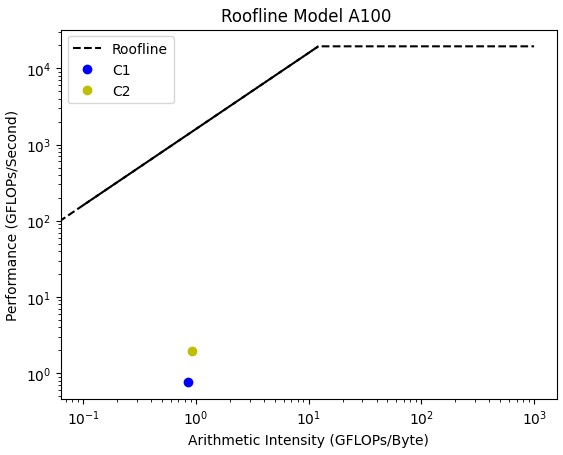

# Optimization-of-Image-inpainting-GANs
## Goal: To enhance the efficiency and speed of GANs for inpainting tasks, while also reducing the data requirements and addressing their inherent instability.

## Our Proposed Solution

The analysis involved training two inpainting models on V100 and A100 with profiling during training using PyTorch profiler to evaluate metrics such as GPU power consumption, utilization, temperature, time per iteration, loss, PSNR, and SSIM. The results were compared across different hardware accelerators and inpainting techniques. To optimize bottlenecks, mixed precision training was used, which enables lower precision data types to speed up computations of the backward pass. Roofline models were built to validate the optimization. The goal of the analysis was to improve energy efficiency and performance while using GANs for inpainting.

## Repository Structure - below are the major contributions along with granular changes in various files of PD-GAN.

- `PD_GAN/` 
  - `optimization/` - All optimizations -  contributed by our team.
   - `models/` - Contains PD-GAN models which were trained on different GPUs using single precision and mixed precision training.
    - `PD_GAN_a100.ipynb/` - Trained on a100 GPU using single precision training.
    - `PD_GAN_a100_MP.ipynb/` - Trained on a100 GPU using mixed precision training.
    - `PD_GAN_v100.ipynb/` - Trained on v100 GPU using single precision training.
    - `PD_GAN_v100_MP.ipynb/` - Trained on v100 GPU using mixed precision training.
  - `Roofline.ipynb` - Roofline model for above 4 models.
  - `make_plots.ipynd` - Contains plots decribing energy, loss, and psnr.
- `Progreesive-Generative-Networks` - Contains optimizations on Progressive Generative Networks
  - `Roofline.ipynb` - Roofline model for Progressive GANs.
  - `plots.ipynb` - contains plots for Progressive GANs decribing energy, loss, and psnr. 
  - `training_single_precison.ipynb` - notebook to train progressive GAN - single precision training. 
  - `training.ipynb` -  notebook to train progressive GAN - mixed precision training. 

## How to run
- To run PD-GAN`
  - Install https://github.com/KumapowerLIU/PD-GAN
  - Download pretrained weights from the above repo for encoder and decoder.
  - In the python notebooks PD_GAN_* run all cells, some libraries are commneted out, use pip install to install them.
  - Change paths to your localhost.
- To run Progressive GANs
  - Install required libraries and install https://github.com/crashmoon/Progressive-Generative-Networks.git
  - Run all cells

## Results

| Model Architecture  | Bottleneck | Optimization |
| ------------- | ------------- | ------------- |
| PD-GAN | Gradient Calculation | Mixed Precision Training  |
| Progressive GANs  | Gradient Calculation | Mixed Precision Training |

| Model |	GPU |	%Bandwidth Increase	| %Performance increase	| Speedup	| %Power decrease |
| ------------- | ------------ |------------- | ------------- | ------------- | ------------- |
| Progressive-GAN | 	A100	| 484.56	| 484.56	| 3.67	| -5.71 | 
| Progressive-GAN | 	V100 | 	50.36 | 	50.36	|  1.37	 |  -51.21 | 
|  PD-GAN	 | A100	 |  134.59 | 	155.43 | 	1.33	|  -14.95 | 
| PD-GAN | 	V100 | 	94.58 | 	106.03 | 	2.24 | 	-33.98 | 

## Roofline

#### PDGAN - V100

#### PDGAN - A100
)

## Documentation
- Project report can be found at [docs/Report.pdf](https://github.com/shreya1313/Deep-Learning-Mini-Project/blob/main/docs/Report.pdf)

## Authors
- Saaketh Koundinya : sg7729@nyu.edu
- Jayanth Jayram Sastry : js12891@nyu.edu
